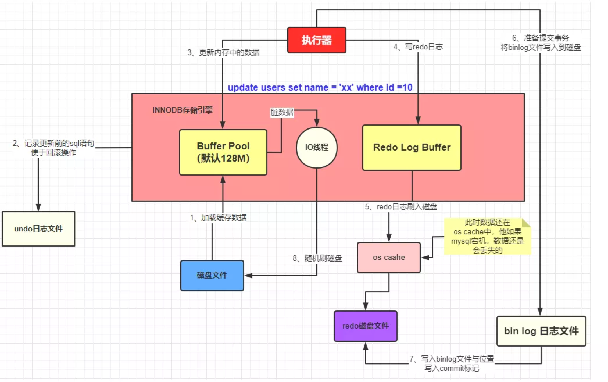

== ㍿ Java连环炮

✐✌✍✡✓✔✕✖♂♀♥♡☜☞☎☏⊙◎☺☻☆♫♬☯•

=== 基础搞怪系列

* Java自动装箱拆箱原理
* Integer的常量缓存池, -128~127的数值对象都是同一个, 不在该范围的才是不同对象
* StringBuffer线程安全, 其方法基本加了synchronized; StringBuilder线程不安全, 底层使用char数组存储的, 改变时new新数组然后复制数据, JVM用StringBuilder优化字符串'+'

=== JVM

* 虚拟机包含哪几个部分: 类加载器, 运行时数据区, 执行引擎
* JVM内存布局
* 堆上对象存储的内容
* 为什么Eden区用标记清除, Survivor区用标记复制, Old区用标记整理
* 可达性分析过程
* GC参数及其调优(讲故事环节)

=== 并发编程

* 同步Synchronized
* CAS
* volatile
* 线程状态
* JUC包下的抽象同步队列(AQS)
** AQS可以引出模板模式, 特点及优缺点
** ReentrantLock
** ReentrantReadWriteLock
** ArrayBlockQueue
** Semaphore
** CountDownLatch
** CycleBarrier
* 线程池
** 为什么要用线程池
** 线程池是如何复用线程的
** 线程池核心参数
** 100﹪CPU问题排查

=== Spring系列

* Spring
** IOC、DI、AOP的概念及实现原理
** spring如何解决循环依赖
*** spring默认创建对象为单例
*** 针对单例对象, 不是全为构造器注入的方式, 通过使用三级缓存解决
*** 这三级缓存存储的内容是什么?只用两级缓存不可以吗?
*** 原型(多例)对象, 无法解决, 底层用一个线程变量记录, 发现循环直接抛异常
** spring中的设计模式, 工厂、模板、单例(重点说)
*** spring单例模式的几种实现方式
*** 这几种实现方式的优缺点
*** 单例模式本身的优缺点
* SpringBoot
* SpringCloud

=== https://mp.weixin.qq.com/s/Oez7gs6TrE1Q71FncmqETw[MySQL]

* 一条查询sql执行的流程
** MySQL是典型的C/S架构, **client端**发请求到**server端**, server端解析SQL、优化SQL确定执行计划, 再到**存储引擎层**: 真正执行负责数据存储和提取, *索引*、**事务**的功能都是**存储引擎**实现的。
** 一条SELECT语句的执行顺序依次为: *from*, *on*, *join*, *where*, *group by*, *having 聚合函数*, *select 筛选列*, *order by*, *limit*

* 索引index(存储引擎实现)
** 索引究竟是什么
*** 索引就是文件数据, 存储在磁盘中, 但是MySQL写数据前会把该数据也放入内存缓存change buffer中, 目的是为了下一次直接读取。 MySQL执行时, 如果用到索引, 就从常驻在内存中的索引根节点出发, 从内存缓存中没有找到, 就依次从磁盘加载一块的内容(会包含多个索引节点数据) 类似于多叉树的搜索过程, 比对目标值和索引值的大小, 来定位数据。
*** 面试里常见的索引(只讨论树形结构下的索引), 聚簇索引、非聚簇索引, 唯一索引, 主键索引、普通索引、联合索引, 覆盖索引, 索引下推
**** 聚簇索引: 确定索引的同时, 实际的数据也拿到了, 即实际数据在索引里也存储了, 所以只需要1次磁盘操作
**** 非聚簇索引: 确定索引的同时, 只能拿到实际数据的标识, 可以是一个指针或者数据ID, 一般可能需要2次磁盘操作拿到实际数据, 为什么是可能2次呢?
因为覆盖索引情况下, 索引里已经有查询所需要的字段数据了, 所以只需要一次磁盘IO可以了, 不需要再根据ID**回表**查询。
**** 唯一索引, 索引字段必须是唯一的, 但是允许null值, UNIQ INDEX
**** *主键索引*, 特殊的唯一索引, 索引字段必须是唯一并且不允许null值, PRIMARY KEY
**** 普通索引, INDEX单个字段, 没啥要求, 索引可以重复也允许为null
**** *联合索引*, INDEX多个字段, 例如INDEX(a, b, c), 在创建索引节点数据时, 索引会有三个部分, 排序优先级是:
先比较a, 相同a值再比较b, 相同b值再比较c.
这是联合索引中**最左前缀**的根本原理。 当where条件后: *a=1 and b=2 and c=3*, 那么索引的三个部分都能充分利用, 也就是要查找的索引节点较少, 不满足的过滤掉了; *a=1 and b=2*; 只利用了^2^/~3~, c为任意值的索引节点都在范围中; a=1; 只利用了^1^/~3~, b、c为任意值的索引节点都在范围中; 其他情况: 没有a的情况, b、c、bc那都会加载所有索引节点; ac跳跃了b, 跟只有a效果是一样的。
**** *联合索引结论*, 多个字段一起做索引, 核心就是制定了索引数据比较顺序, 如果前面的字段不指定, 那就没法比较, 只能捞出所有节点来比较。 因此创建联合索引时, 将最常查询的列放在最左边, 同时where条件书写时也与联合索引顺序保持一致。
**** *覆盖索引*, 就是一种特殊的查询情况, 需要的字段恰好就在索引字段中, 不需要回表
**** *索引下推*, 一般在范围查询中出现, MySQL以前的版本对于范围查询, 存储引擎都是忽略范围的条件查出所有的数据, 让server端过滤。 现在存储引擎通过索引查数据时, 会拿着范围条件比对, 不符合的数据直接过滤掉。

** 索引底层存储原理
*** MySQL两种常用存储引擎, *MyISAM和InnoDB索引结构都使用B+树*, 主要区别:
**** MyISAM索引文件和数据文件是分开的, InnoDB主键索引文件就包含了数据。
**** MyISAM不支持事务、只有表级锁(锁定整个表)、不需要主键、索引文件都是非聚簇索引, 非叶子节点只有索引数据, 叶子节点存储索引数据和真实数据的地址, 索引MyISAM普通索引命中后不需要回表
**** InnoDB支持事务、支持行级锁(可以为每一行加锁)、主键索引文件是聚簇索引, 非叶子节点只存储主键ID, 叶子节点存储主键ID和真实数据; 非主键索引文件的非叶子节点只存储索引数据, 非主键索引文件的叶子节点存储索引数据和主键ID, 一般情况下通过普通索引定位到主键ID, 再使用主键ID回表查询。
*** 索引的树形结构演进故事: 二叉排序树, 红黑树, B树(B-树), B+树
**** *二叉排序树*, 就是二分查找, 树的高度log~2~n+1到n(八字仅一撇树)之间, 查找效率也是O(log~2~n)到O(n)之间
**** *红黑树*, 因为二叉排序树查找效率不稳定, 所以需要平衡的二叉排序树, 红黑树就是常用的一种。红黑树高度是2•log~2~n, 时间复杂度是O(2•log~2~n)
**** *B树(B-树)*, 是对红黑树的改进。红黑树查找效率虽然稳定在O(log~2~n)级别, 但是还是会受到节点n的影响, MySQL数据库存储的数据多则2000w行, 其树高为25, 最坏情况下需要进行25次磁盘IO, 如果把二叉树拓展为2-3树, 即父节点最多可以有3个子节点(这是MySQL底层真实的树结构), 树高可以减少为15, 那么可以节省40%的磁盘IO时间,
**** 磁盘读取知识: 对于磁盘IO来说, 都是采取页读(及预读, 程序局部性原理, 把该页后的几页也读出来)的方式, 一页是4KB, 如果设置一个索引节点也是2KB, 如果真实数据很大, 那相对的索引节点就少了, 那磁盘IO也就多了 之所以不使用更多的分叉树, 一是更多分叉实现起来更复杂, 二是MySQL单表2000万的数据再怎么优化底层收效甚微, 应用其他方案优化性能。
**** *B+树*, 是从磁盘的角度优化B树(B-)树, 二叉排序树、红黑树、B树(B-树)索引节点里直接存储了真实数据, 那么一个索引节点里的索引数就少, 那么就分散着更多的索引节点, 相对来说磁盘IO次数就多。 **B+树主键索引里**非叶子节点只存储索引数据, 在叶子节点存储真实的数据, 目的就是为了让一个索引节点中存储更多的数据, 利用好磁盘页的空间(B树), 并极大减少磁盘IO次数。 此外, 由于B树(B-树)索引节点都是K-V(索引和真实数据), 那么查询是不稳定的, 最好时间复杂度是O(1), 涉及到范围查找时B树可能要跨层访问; 而B+树数据都在叶子节点, 并且叶子节点间用顺序链表相连, 天然的排序结构, 很好的支持范围查找。

** 通过索引定位数据的常见情况
*** select * where条件为主键ID, 查一次即可拿到数据
*** select * where条件为普通索引, 需要两次(一次索引定位+一次回表)才拿到数据
*** select 索引字段 where条件为索引, 只需要一次即可拿到数据, 这叫做**覆盖索引**

* ACID、隔离级别
** A:原子性, I:隔离性, D:持久性都是为了C:一致性存在的, 其中A:原子性涉及到MySQL的Redo Log/Undo Log的配合, 参加下文7种日志的分析
** 隔离级别
*** 读未提交(Read Uncommitted), 就是线程A可以读到线程B还没有提交的数据, 会产生脏读
*** 读已提交(Read Committed), 解决了脏读, 但是线程A在多次读同一条数据时, 其他线程可能频繁更改数据, 导致线程A每次读取数据不一样, 即不可重复度
*** 可重复读(Repeatable Read), 解决了不可重复读, 但是线程A读取ID=100发现不存在该数据, 然后线程B插入了一条ID=100的数据, 这样线程A插入数据时会报错:主键冲突, 会产生幻读。 但是注意, MySQL默认级别就是可重复读(Repeatable Read), 通过引入锁和MVCC(多版本并发控制)解决了幻读问题
*** 可串行化(Serializable), 多个事务排队等待, 性能最差

* 锁与事务
** https://mp.weixin.qq.com/s/3f1lZ0HPkL3vqr8JTwFjOw[MySQL的锁]
*** 按照粒度来分: 表锁, 行锁; 按照使用方式来说: 乐观锁(CAS), 悲观锁; 按照功能来分: 共享读锁(S锁), 排他写锁(X锁)
*** 共享读锁(S锁), 多个线程(事务)读同样的数据, 都可以拿到读锁, 多可以执行读取操作, 但是不能做写操作, 因为做写操作需要获取排他锁(X锁), 获取S锁的条件是, 其他线程加过X锁, 自己可以加过X锁, 即: 我可以写那肯定能读; 就是别人一定不能写, 那我就可以读。 获取X锁的条件是, 其他线程没有加过X锁, 也没有加过S锁, 也就是其他线程既没有读也没有写
*** 两个线程产生死锁示例:
**** 线程A、B第一步同时读取数据拿到S锁
**** 线程A更新该条数据, 无法更新进入阻塞, 等待B释放S锁(写锁X需要其他线程都没有拿到读锁或者写锁)
**** 线程B更新该条数据, 无法更新进入阻塞, 等待A释放S锁(写锁X需要其他线程都没有拿到读锁或者写锁)
**** 互相等, 死锁产生。解决办法: 开启MySQL死锁检测, 并为锁设置最大等待时间, 等待超时就直接失败
*** 表锁, 锁住整张表, MyISAM引擎只支持到表锁; 行锁, 锁住某个数据行, InnoDB支持到行锁, 但是注意: InnoDB只有通过索引才加行锁, 不通过索引就加表锁, 是否通过索引90%的情况取决于SQL中有没有使用索引, 还有10%是虽然SQL写了索引, 但是MySQL的执行器优化时发现全表扫描更快, 那就不适用索引了; 结合前面对索引的分析, 可以发现行锁就是锁定索引, 那么普通索引允许重复值, 则相同索引的多行数据都会被上行锁
*** 间隙锁: Gap Locks, 唯一索引范围查询、普通索引查询, 在索引之间加锁, 锁住一个区域, 防止其他事务更新数据导致幻读, 区间是前后开区间, 不包括行本身
*** 间隙锁: Next-Key Locks=行锁+Gap Locks, 这样锁住的区间就是前后开区间包括了行本身
*** 间隙锁结论: 主键索引不会产生间隙锁, 范围查询会产生间隙锁, 使用不存在的索引条件也会加间隙锁, 目的是保证在一个事务中的最大索引都是一致的。举例:
索引数据为3, 6, 最大为6, 查询条件为8, 那么就会在(6, 8]加锁, 不允许插入6(只允许一个6, 出现两个6看到的也不一样了)、7、8
*** MVCC, 多版本视图并发控制, 针对InnoDB的行来处理的
**** 实现方式: 在每一行数据后面增加了2个隐藏列, 一列保存该行的创建时间, 一行保存该行的系统版本号, 并且该行也会有一个事务ID, 标明是哪个事务创建的
**** 底层原理: 每行数据的更新, 都会写入undo日志, 通过undo日志及行的最新版本号能推算出历史版本号, 此外就是行数据的快照(视图), 针对不同隔离级别, 快照在事务中也有不同的特点:
***** 读未提交(Read Uncommitted), 直接读取数据的最新版本, 会有脏读
***** 读已提交(Read Committed), 每次读取前都生成一个新的快照, 会有不可重复读(读取的行版本号都不一样)
***** 可重复读(Repeatable Read), 事务A第一次读取时才生成快照, 此后事务A内所有读取都是共用该快照, 因而每次读取都是一样的, 解决了可重复读取, 这个时候再理解幻读和间隙锁就好理解了: 在没有间隙锁的情况下, 事务A内只会对第一次查询到的数据行的索引加行锁, 在索引间的和索引之外的, 没有上锁, 因而可能事务B插入新数据, 事务A插入相同数据发生主键冲突; 或者是事务B插入了数据100但是没提交, 事务A再过来读取一个范围[99, 101]看到了数据100, 此后一顿操作猛如虎, 但是事务B撤销事务, 事务A就出现幻读了。有了间隙锁的机制, 因为间隙锁能锁定范围区间, 保证两个事务不会同时操作同一个区间的数据, 那么事务在整个过程中数据就一致了。
***** 可串行化(Serializable), 串行加锁, 单线程操作数据, 数据不会不一致, 但是性能不敢直视。

** https://mp.weixin.qq.com/s/YXH47C4P2Sc1OQblyZlZzg[7种日志]
*** MySQL数据写入流程(以update为例)
**** 1.从磁盘加载数据到 https://mp.weixin.qq.com/s/uyu0lKz2_N5BYgITKz71CQ[缓冲池BufferPool]
**** 2.将更新前的SQL语句写入**undo log**, server端的日志
**** 3.执行update语句更新**缓冲池BufferPool中的数据**, 后台由其他线程根据一些策略异步刷入磁盘中
**** 4.将update语句写入**RedoLogBuffer**
**** 5.将**RedoLogBuffer**内存中的SQL刷入操作系统缓存(OS cache), 此时还并未落判盘, 事务只是prepare状态
**** 6.准备提交事务, 将**bin log**写入磁盘, , server端的日志
**** 7.bin log落盘后, 再将操作系统缓存(OS cache)中的RedoLogBuffer信息写入**redo log**文件, InnoDB存储引擎的日志, 同时会写入committed标记, 代表该事务已提交
**** MySQL的事务涉及**undo log**:负责事务回滚数据一致性、*redo log*负责数据库宕机**缓冲池BufferPool还未落盘的脏页数据问题**、*bin log*负责数据库最终的数据结果
**** **redo log**是用来辅助**bin log**, 保证宕机情况下, 底层存储数据与**bin log**数据一致, 否则在主从模式下, 主库挂了, 从库会比主库多数据的
**** *relay log*, MySQL主从同步, 从库的IO线程拉取主库的**bin log**信息, 写入*relay log*, 并将数据同步到的位置记录在**master-info**, 用于下次找主库拉取数据的位置, 可理解为kafka的消费偏移量, 另外一个线程异步从**relay log**获取及解析执行**bin log**
**** 慢查询日志**slow query log**, 记录慢SQL, 默认关闭, 需要排查时再开启参数
**** 一般查询日志**general query log**, 记录用户所有操作, 例如客户端连接时间, 发送的所有SQL, 默认关闭
**** error.log, 错误日志, 一般错误信息, 以及初始化缓冲池BufferPool

* MySQL优化
** 索引原则
*** 常用字段建索引, 这些字段最好是数值而非字符串, 并且尽可能短
*** 联合索引遵循最左匹配原则
** 善用执行计划explain, 起返回结果有如下**10个字段**(某些可能是12个字段, partitions匹配分区; filtered按条件过滤的百分比)
*** *id*: 查询的序列号
*** *select_type*: 查询类型
*** *table*: 查询表名
*** *type*: 扫描方式
*** *possible_keys*: 可能使用到的索引列
*** *key*: 实际使用到的索引
*** *key_len*: 实际索引长度
*** *ref*: 与索引比较的列
*** *rows*: 该sql预计扫描的行数
*** *Extra*: sql语句额外信息, 比如排序方式
*** 使用执行计划explain优化慢查询经验
**** 先使用慢查询日志定位需要优化的慢SQL
**** 执行explain 慢SQL, 重点关注
***** key: 有没有使用索引
***** key_length: 索引长度, 联合索引是否使用充分
***** type: 查看索引类型(为ALL那就很有优化空间)
***** Extra: 附加信息, 如果有**Using filesort**, 考虑由业务代码排序, 临时表也可考虑拆分解耦SQL
*** 上述详细说明:

[source,mysql]
----
# id, 代表sql执行顺序, 会出现id相同、id不同、id既有相同又有不同的情况
# 总则就是, id大的先执行, id相同时从上往下执行
explain SELECT test1.* from test1 t1 inner join (SELECT max(id) mid FROM test1 GROUP BY id) t2 on t1.id = t2.id

# ---------------------------
# select_type:
# 1. SIMPLE: 简单查询, 不包括子查询和UNION
# 2. PRIMARY: 主要查询, 复杂查询中的最外层查询
# 3. SUBQUERY: 子查询, 出现在SELECT或WHERE后的参数
# 4. DERIVED: 派生查询, 出现在FROM后的参数
# 5. UNION: 联合查询, 出现在UNION之后的参数

# ---------------------------
# type:
# system: 表只有一条记录
# const: 通过一次索引就能找到
# eq_ref: 用于唯一索引(包括主键)的扫描
# ref: 用于非唯一索引的扫描
# range: 范围扫描
# index: 全索引扫描
# ALL: 全表扫描
# system优于const优于eq_ref优于ref优于range优于index优于ALL
----

=== Redis

* 缓存穿透、缓存击穿、缓存雪崩的概念及应对方法
* 基本数据结构及应用场景
* Pipeline原理及缺点
* 事务特点
* 主从、哨兵、集群的运转故事

=== MQ

* Kafka
* RocketMQ
* Kafka与RocketMQ的区别

=== 算法与数据结构

* JDK的数据结构与算法
** HashMap, TreeMap|TreeSet, ArrayList, LinkedList
** 二叉树(在内存中的数据结构, 顺序数组或者链表)、红黑树、链表的增、删、查流程及算法复杂度

* Interview中的Coding题目
** [二叉树中最大路径和](https://blog.csdn.net/qq_15764477/article/details/106882100)
*** 递归
*** 考虑子树, 最大路径就4种, root| root+left| root+right| root+left+right
** [nlogn时间和常数级空间链表排序](https://www.jianshu.com/p/030a59528323)
*** 归并排序
** [.line-through]#[无序数组最大上升子序列长度](https://www.freesion.com/article/71831322689/)#
** link:SuanFaHaHaHa.java[两个超大整型字符串相加]
*** 基本思路: 区分短串和长串, 以长串为标准进行一次循环, 循环中与短串求和并确定进位、结果值
*** 优化: 将短串拼接到长串后面, 长串长度即为分界点, 循环长串时可以计算到短串索引, 不存在的则为0
*** 要点: 两数相加结果比长串可能多一位
**** indexA = maxLength - 1, 长串倒着遍历
**** indexB = indexA + shortB.length(), 短串也倒着遍历, 索引推导
** 验证二叉搜索树
** 给你两个非空的链表，表示两个非负的整数。它们每位数字都是按照逆序的方式存储的，并且每个节点只能存储一位数字。请你将两个数相加，并以相同形式返回一个表示和的链表
*** 参考两字符串相加
** 返回一个树的左视图
** 给定一个二叉树, 找到该树中两个指定节点的最近公共祖先
** 求一个环形链表的环的长度
** 一个环上有10个点,编号为0-9,从0点出发,每步可以顺时针到下一个点,也可以逆时针到上一个点,求:经过n步又回到0点有多少种不同的走法
*** 环球旅行, 动态规划table(step)(index) = table(step-1)((index+1+n)%n) + table(step-1)((index-1+n)%n)
** 找出所有相加之和为 n 的 k 个数的组合，组合中只允许含有 1 - 9 的正整数，并且每种组合中不存在重复的数字
*** BitMap
** 最长不重复的连续子串
*** 滑动窗口
** 判断一个树是否是平衡二叉树
** 给定一个长度为N的整形数组arr，其中有N个互不相等的自然数1-N，请实现arr的排序，但是不要把下标0∼N−1位置上的数通过直接赋值的方式替换成1∼N
*** SOS
** 对于两个字符串, 计算最长公共子串
*** 基本思路: 两个字符串构建二维矩阵, 相同的置为1, 不同的置为0
*** 优化: 两个字符串长短不一, 公共子串肯定不超过较短的字符串, 以它为外循环, 依次匹配长字符串
*** . 字符串为空情况处理, 长串包含子串特殊情况
*** 要点: 尽量构建横向(行少列多)二维矩阵时, 这样比较符合视觉
*** . 因此: 二维表table[m][n], m是行数, n是列数, m应<=n
*** . 即: m对应短串, n对应长串
*** 重要代码点: 借助两个变量, 重复字符数repeatNum, 最后相等字符的短串最长索引lastIndex
*** . 匹配时字符不等, table[i][j]都为0
*** . 只要匹配时字符相等, table[i][j]初始化要么为1, 要么左上角字符匹配结果+1: table[i-1][j-1]
*** . 最后一起判断如果重复字符数repeatNum小于table[i][j], 那么更改repeatNum和lastIndex
** 对于一个字符串，计算其中最长回文子串的长度
**** 一般为n^2, 将字符串翻转, 得到两个字符串, 就可以利用两个字符串最长公共子串解决了
**** Manacher算法可以到n

=== 分布式系统

* Zookeeper
* 分布式事务
* 分布式锁

=== 大数据

* Flink
* HBase

== AsciiDoc文档语法

- [.line-through]#删除线#
- link:/reportsystem-service/src/main/java/com/huitongjy/report/constants/RedisKey.java[文件连接]
- http://www.debuggerpowerzcy.top[URL连接]
